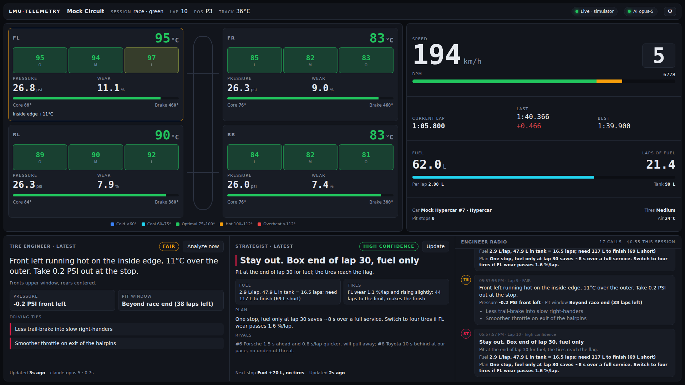

# LMU Telemetry Dashboard

A second-monitor dashboard for **Le Mans Ultimate** with an AI race engineer.

A small Node.js server reads live telemetry from the game through the
`rFactor2SharedMemoryMapPlugin64.dll` plugin, streams it to a browser page, and
asks Claude for:

- **Tire analysis** (every 5 s): tire health, pressure changes, pit window,
  temperature assessment and driving tips
- **Race strategy** (after every lap and pit stop): when to pit, fuel status,
  tire trend, overall plan and rival pace
- **Voice engineer** (push to talk on your wheel): ask a question out loud and
  hear the answer in your headset, using the browser's free built-in speech



*Screenshot from the built-in simulator. The Claude text shown is sample data.*

## Contents

1. [Prerequisites](#1-prerequisites)
2. [Installation](#2-installation)
3. [Running it](#3-running-it)
4. [Voice engineer](#4-voice-engineer)
5. [Configuration](#5-configuration)
6. [API cost](#6-api-cost)
7. [Troubleshooting](#7-troubleshooting)
8. [How it works](#8-how-it-works)

---

## 1. Prerequisites

| You need | Notes |
|---|---|
| **Windows 10 or 11** | The game's shared memory can only be read on the PC running LMU. |
| **Le Mans Ultimate** | Installed through Steam. |
| **Node.js 20 LTS or newer** | Download from [nodejs.org](https://nodejs.org/). Node 16 and 18 are too old: the web server library (Express 5) needs 18+, and 18 no longer gets security updates. Check with `node -v`. |
| **Claude API key** | Create one at [console.anthropic.com](https://console.anthropic.com/settings/keys) and add credit to the account. Without a key the dashboard still works, just without the AI panels. |
| **rFactor2SharedMemoryMapPlugin64.dll** | Free plugin that exposes LMU's telemetry. Step 2.4 covers it. |

No compilers or Visual Studio build tools are needed; every dependency ships
pre-built for Windows.

---

## 2. Installation

### 2.1 Download the project

**With Git:**

```powershell
git clone https://github.com/dustysi221/dustysi221.git
cd dustysi221
git checkout claude/kind-shannon-g0iy1c   # until this branch is merged into main
cd lmu-telemetry-dashboard
```

**Without Git:** on GitHub, switch to the `claude/kind-shannon-g0iy1c` branch,
click **Code → Download ZIP**, unzip it, and open the `lmu-telemetry-dashboard`
folder.

### 2.2 Install dependencies

Open PowerShell (or Command Prompt) in the `lmu-telemetry-dashboard` folder:

```powershell
npm install
```

### 2.3 Add your Claude API key

```powershell
copy .env.example .env
notepad .env
```

Replace `your-key-here` with your key and save:

```ini
CLAUDE_API_KEY=sk-ant-...
```

`.env` must sit in the same folder as `server.js`. It is listed in
`.gitignore`, so your key is never committed. Keep it private.

### 2.4 Install the shared memory plugin into LMU

1. Find the LMU install folder: in Steam, right-click **Le Mans Ultimate →
   Manage → Browse local files**. It is usually
   `C:\Program Files (x86)\Steam\steamapps\common\Le Mans Ultimate`.
2. Open its `Plugins` folder. If `rFactor2SharedMemoryMapPlugin64.dll` is
   already there (SimHub, CrewChief and similar tools install it), skip to 2.5.
3. Otherwise download the latest release from
   [TheIronWolfModding/rF2SharedMemoryMapPlugin](https://github.com/TheIronWolfModding/rF2SharedMemoryMapPlugin/releases)
   and copy `rFactor2SharedMemoryMapPlugin64.dll` into
   `Le Mans Ultimate\Plugins\`.

### 2.5 Enable the plugin

LMU loads a plugin only when it is enabled in
`Le Mans Ultimate\UserData\player\CustomPluginVariables.JSON`.

1. Start LMU once with the DLL in place, then quit it. The game adds an entry
   for the plugin to that file.
2. With the game **closed**, open `CustomPluginVariables.JSON` in a text editor
   and set `" Enabled"` to `1` for the plugin. The key really does start with a
   space. The entry should look like this:

   ```json
   "rFactor2SharedMemoryMapPlugin64.dll": {
     " Enabled": 1,
     "DebugISIInternals": 0,
     "DebugOutputLevel": 0,
     "DebugOutputSource": 1,
     "DedicatedServerMapGlobally": 0,
     "EnableDirectMemoryAccess": 0,
     "EnableHWControlInput": 0,
     "EnableRulesControlInput": 0,
     "EnableWeatherControlInput": 0,
     "UnsubscribedBuffersMask": 160
   }
   ```

   If the file has no entry, add this block inside the outer `{ }` (put a comma
   after the previous entry).
3. `UnsubscribedBuffersMask` switches off buffers you don't need. The dashboard
   reads **Telemetry (1)** and **Scoring (2)**, so the number must not include
   1 or 2. `160` (graphics + weather off) is fine.

4. Keep `EnableHWControlInput`, `EnableDirectMemoryAccess`,
   `EnableRulesControlInput` and `EnableWeatherControlInput` at `0`. The
   dashboard only reads data and never needs the plugin to send anything to the
   game.
5. In LMU, open **Settings → Gameplay** and turn **Enable Plugins** on (recent
   LMU versions have this switch; no plugin loads without it).

---

## 3. Running it

**Easiest:** double-click **`Start Dashboard.bat`** in the project folder (or
**`Start Simulator.bat`** to test without the game, **`Update Dashboard.bat`** to
get the latest version). Plain-language notes for every step are in the
**`NOTES`** folder, starting with `00 START HERE.txt`.

Or by hand:

1. **Start the server** in the `lmu-telemetry-dashboard` folder:

   ```powershell
   node server.js
   ```

   (`npm start` does the same.) You should see:

   ```
   LMU telemetry server on http://127.0.0.1:3000
   WebSocket: ws://127.0.0.1:3000/telemetry
   Telemetry source: rf2
   Claude tire analysis: claude-opus-5 (effort low) every 5s while a dashboard is connected
   Claude strategy: after every completed lap and pit stop
   ```

2. **Open the dashboard** at **http://localhost:3000** in a browser on your
   second monitor. Press F11 for full screen. Until the game is running, the
   status pill shows *Waiting for LMU*.

3. **Start an LMU session** (practice, qualifying or race) and drive out of
   the garage. The pill turns green (*Live*) and the tires and gauges start
   moving. The tire engineer reports within a few seconds, and the strategist
   after your first clean lap. Use **Analyze now** and **Update** to ask for a
   fresh call at any time.

Stop the server with **Ctrl+C**. Leave the dashboard tab open between sessions;
it reconnects by itself.

### Try it without the game

The simulator runs a 90-minute race with AI rivals and a pit stop, on any OS:

```powershell
npm run mock
```

Add `MOCK_SPEED=10` to `.env` to run it 10× faster. Claude calls cost the same
in the simulator as in the game.

### View it on a tablet or phone

Set `HOST=0.0.0.0` in `.env`, restart the server, allow Node.js through the
Windows Firewall when asked (private networks only), and open
`http://<your-PC's-IP>:3000` on the device. `ipconfig` shows the PC's IP.

---

## 4. Voice engineer

Hold a button on your wheel, ask a question, release, and the engineer answers
in your headset:

> **You:** "How are my tires looking?"
> **Engineer:** "Copy that. Front left running hot, take 0.2 PSI out at the stop. Box end of lap 30."

Speech-to-text and text-to-speech use the **Web Speech API built into Chrome and
Edge**, so they cost nothing. Only the answer itself is a Claude call (about 1
cent per question, see [API cost](#6-api-cost)).

### Set it up (once)

1. Open the dashboard in **Chrome or Edge**. Firefox has no speech recognition.
2. Click **Enable voice** (top right) and allow the microphone when the browser
   asks. Browsers only allow a page to talk after it has been clicked once, so
   do this each time you open the dashboard.
3. Open ⚙ → **Voice · push to talk** → **Assign**, then press the wheel button
   you want to use. Until you assign one, button 0 on any controller is used.
   If no wheel is listed under "Detected", press any button on the wheel first:
   browsers only show a controller after it has been used.
4. Pick an **Engineer voice** and **Speech speed**, and use **Test voice** to
   check it plays through your headset. Edge's "Natural" voices sound best.

### Use it

1. **Hold** your wheel button (or hold **V** while the dashboard is focused, or
   hold the mic button). A red bar shows **Listening…** with what it hears, live.
2. **Release** to send. The bar shows what was heard, then the engineer's
   answer, which is also spoken and added to the **Engineer radio** feed.
3. Pressing the button again while the engineer is talking cuts them off.

The engineer sees your live tires, fuel, pace, gaps to the cars around you,
and the tire engineer's and strategist's latest calls, and remembers your last
few questions, so follow-ups like "what about the rears?" work.

Tick **Read out new engineer calls** to also hear the tire engineer and
strategist whenever their advice changes.

### Good to know

- **Keep the dashboard window visible** on your second monitor (not minimized).
  Browsers stop reading controllers for hidden pages. Chrome keeps reading them
  while another window, like LMU, has focus; if your wheel button does nothing
  while driving, click the dashboard once and try again, then try the other
  browser.
- **Speech recognition needs internet.** Chrome sends the recording to Google's
  speech service and Edge to Microsoft's. It's free, but the audio leaves your PC.
- The engineer's personality, answer length and radio phrases live in
  `src/voice-prompts.js`. Edit it and restart the server to change them.

---

## 5. Configuration

All settings live in `.env`; `.env.example` lists them with comments. Restart
the server after a change.

| Setting | Default | What it does |
|---|---|---|
| `CLAUDE_API_KEY` | — | Your Claude API key. `ANTHROPIC_API_KEY` also works. |
| `HOST` / `PORT` | `127.0.0.1` / `3000` | Where the dashboard is served. |
| `TELEMETRY_SOURCE` | `auto` | `auto` = LMU on Windows, simulator elsewhere; or `rf2` / `mock`. |
| `ANALYSIS_MODEL` | `claude-opus-5` | Claude model for both engineers. Also `claude-sonnet-5`, `claude-haiku-4-5`. |
| `ANALYSIS_EFFORT` | `low` | How hard Claude thinks: `low` … `max`. Higher is slower and costs more. Ignored for Haiku. |
| `ANALYSIS_INTERVAL_MS` | `5000` | How often the tire engineer runs. **The biggest cost lever.** |
| `ANALYSIS_FALLBACKS` | `true` | If Claude declines a request, retry it on Anthropic's recommended fallback model. |
| `TIRE_OPTIMAL_MIN_C` / `TIRE_OPTIMAL_MAX_C` | `75` / `100` | Tire operating window. Generic default; set it for your car and compound. |
| `TIRE_WEAR_LIMIT_PERCENT` | `75` | Wear at which a tire counts as done (drives the pit window). An estimate; tune it. |
| `PIT_LOSS_SEC` | `35` | Time lost per stop incl. pit lane. Set it per track; undercut/overcut advice depends on it. |
| `FUEL_RESERVE_LAPS` | `1` | Extra fuel the strategist plans to carry to the flag. |
| `STRATEGY_MAX_INTERVAL_MS` | `180000` | Refresh strategy at least this often on very long laps. |
| `VOICE_EFFORT` | `low` | Claude effort for spoken answers. `low` answers fastest. |
| `MOCK_SPEED` | `1` | Simulator time multiplier. |

The dashboard's ⚙ menu has per-screen settings (temperature window, psi/kPa,
km/h/mph, push-to-talk button, voice, speech speed), saved in the browser.

---

## 6. API cost

You pay Anthropic per token. The server only calls Claude **while a dashboard
is open and the car is live** (not paused, not in menus), and never starts a new
call before the previous one has finished.

Each call sends about 2,000–2,500 tokens and gets back about 500–900 (the
answer plus Claude's thinking). Estimated cost **per hour of driving**, with
~100-second laps:

| Setup | Tire engineer | Strategist | **Per hour** |
|---|---|---|---|
| Opus 5, tire analysis every 5 s *(default)* | ~$22 | ~$1.30 | **~$23** |
| Opus 5, every 15 s | ~$7 | ~$1.30 | **~$8** |
| Sonnet 5, every 5 s | ~$9 | ~$0.50 | **~$9** |
| Sonnet 5, every 10 s | ~$4 | ~$0.50 | **~$5** |
| Haiku 4.5, every 5 s | ~$3 | ~$0.20 | **~$3.50** |

Prices used: Opus 5 $5 / $25, Sonnet 5 $2 / $10, Haiku 4.5 $1 / $5 per million
input / output tokens. Treat the table as ±50%: output length varies with
Claude's thinking.

**For roughly $5–15 per one-hour race**, use Sonnet 5, or keep Opus 5 and run
the tire engineer every 10–15 s:

```ini
ANALYSIS_MODEL=claude-sonnet-5
ANALYSIS_INTERVAL_MS=5000
```

or

```ini
ANALYSIS_MODEL=claude-opus-5
ANALYSIS_INTERVAL_MS=15000
```

**Voice questions** add about 1 cent each with Opus 5 (about half that with
Sonnet 5): roughly 2,000 tokens in and 150 out. Speech-to-text and
text-to-speech are free.

The **Engineer radio** header shows the real number of calls and the running
cost for the session, so you can check against your own driving. Set a monthly
spend limit in the [Anthropic Console](https://console.anthropic.com/) as a
safety net.

---

## 7. Troubleshooting

**The dashboard says "Waiting for LMU" while I'm driving**
- Check that `rFactor2SharedMemoryMapPlugin64.dll` is in `Le Mans Ultimate\Plugins\`.
- Check that **Settings → Gameplay → Enable Plugins** is on in LMU.
- Check that `" Enabled": 1` is set in `UserData\player\CustomPluginVariables.JSON` (with the leading space). Edit that file only while the game is closed.
- Check that `UnsubscribedBuffersMask` doesn't include 1 (telemetry) or 2 (scoring).
- Restart LMU after changing the plugin or the JSON.
- If LMU runs as administrator, run PowerShell as administrator too (or run neither elevated).

**The status pill says "Paused" and the dashboard is dimmed**
Hover over the pill for the reason. *Connected, no player car on track*: you're
in the menus, spectating, or watching a replay; drive out of the garage.
*Connected, telemetry paused*: the game is paused. Either way it recovers by
itself when telemetry resumes.

**Numbers look wrong** (temperatures around −273 °C, pressures of 0, nonsense wear)
The plugin version doesn't match the data layout the server expects. Install
the latest plugin release, then check `http://localhost:3000/api/snapshot`. On
track, tire temperatures should be roughly 60–110 °C and pressures roughly
150–220 kPa.

**"Server offline · retrying" in the browser**
The server isn't running, or it stopped with an error. Check the PowerShell
window and start it again with `node server.js`.

**`Port 3000 is already in use`**
Something else uses port 3000. Set `PORT=3001` in `.env` and open
`http://localhost:3001`.

**The AI pill says "AI off"**
There's no `CLAUDE_API_KEY` in `.env`, or `.env` isn't in the same folder as
`server.js`. Fix it and restart the server.

**"Invalid Claude API key"**
Copy the key again from the Console. It starts with `sk-ant-` and has no spaces or quotes.

**"Claude API error 400" or "404" mentioning the model**
Your account may not have access to that model. Try `ANALYSIS_MODEL=claude-sonnet-5`.

**"Claude API rate limit hit"**
Your account tier's rate limit is lower than the call rate. Raise
`ANALYSIS_INTERVAL_MS` (for example `10000`) or use a smaller model.

**The strategist says "Waiting for the first completed lap"**
Automatic strategy calls start after your first clean lap, since before that
there's no fuel or wear rate to work from. Press **Update** to ask anyway.

**The voice button says "Voice unsupported"**
Use Chrome or Edge. Firefox has no speech recognition.

**"Microphone blocked"**
Click the padlock/site icon in the address bar, allow the microphone for
`localhost`, and reload.

**The wheel button does nothing**
Open ⚙ and check your wheel is under **Detected** (press a wheel button first).
Click **Assign** and press the button again. Keep the dashboard window visible,
not minimized. If it works with the dashboard focused but not while LMU has
focus, try the other browser (Chrome or Edge).

**The engineer answers but I hear nothing**
Click **Enable voice** again after reloading the page, check **Test voice** in
⚙, and check Windows is sending sound to your headset.

**"Didn't catch that"**
Hold the button for the whole question and speak after the red bar appears.
Speech recognition needs an internet connection.

**`npm install` fails**
Check `node -v` shows 20 or newer. Behind a company proxy, set npm's `proxy`
and `https-proxy` config.

**The tablet can't reach the dashboard**
Set `HOST=0.0.0.0`, restart, allow Node.js through the Windows Firewall on
private networks, and use the PC's IP address, not `localhost`.

---

## 8. How it works

```
LMU ──► rF2 shared memory plugin ──► server.js ──► ws://localhost:3000/telemetry ──► dashboard
                                        │
                                        ├─ tire-analyzer.js ──► Claude (every 5 s)
                                        ├─ strategy-analyzer.js ──► Claude (every lap / pit stop)
                                        └─ voice-assistant.js ──► Claude (each push-to-talk question)

wheel button ─► wheel-input.js ─► voice-engine.js (speech → text) ─► server ─► voice-engine.js (text → speech)
```

| File | Purpose |
|---|---|
| `server.js` | Express + WebSocket server, polling loop, analysis scheduling |
| `public/index.html` | The dashboard (inline CSS/JS, no build step) |
| `public/wheel-input.js` | Push-to-talk wheel button via the Gamepad API, with button learning |
| `public/voice-engine.js` | Web Speech API: speech-to-text while the button is held, text-to-speech for answers |
| `src/rf2Layout.js` | Plugin memory layout (`#pragma pack(4)` structs) |
| `src/sharedMemory.js` | Opens `$rFactor2SMMP_Telemetry$` / `$rFactor2SMMP_Scoring$` through kernel32 and copies consistent snapshots |
| `src/telemetryParser.js` | Raw buffers → °C, kPa, wear %, lap data, the whole field |
| `src/tireHistory.js` | 1 Hz tire history: per-lap wear and 60 s trends for the current set |
| `src/sessionTracker.js` | Whole-session history: per-lap time/fuel/wear, stints, pit stops, rival lap times |
| `src/claudeClient.js` | Shared Claude API wrapper: structured JSON output, refusal/fallback handling, cost tally |
| `src/brevity.js` | Caps engineer text length so it stays glanceable |
| `src/tire-analyzer.js` | Tire metrics + Claude tire engineer |
| `src/strategy-analyzer.js` | Strategy metrics + Claude strategist |
| `src/voice-assistant.js` | Answers spoken questions with live telemetry context and short memory |
| `src/voice-prompts.js` | The voice engineer's personality, answer length and radio phrases |
| `src/mockSource.js` | Simulator that writes real plugin-format buffers |

Both analyzers first compute the numbers in code (edge temperature spreads,
wear per lap, laps to the wear limit, fuel per lap, the last lap you can pit on,
rival gaps and pace), then give those to Claude. Claude does the engineering
judgment and never has to do the arithmetic. Answers come back as JSON that
matches a fixed schema.

Run the tests with `npm test`. For a step-by-step test plan, from the
simulator to the real game, see [TESTING.md](TESTING.md).

### Timing

| Loop | Default | Setting |
|---|---|---|
| Shared-memory read + broadcast to dashboards | 10 Hz | `BROADCAST_HZ` |
| Tire/session history sample | 1 s | `TIRE_SAMPLE_MS` |
| Claude tire analysis | 5 s | `ANALYSIS_INTERVAL_MS` |
| Claude strategy | after each clean lap and pit stop (max 180 s apart) | `STRATEGY_MAX_INTERVAL_MS` |

### HTTP and WebSocket API

HTTP: `GET /api/health`, `GET /api/snapshot`, `GET /api/tire-analysis`, `GET /api/strategy`.

WebSocket `ws://localhost:3000/telemetry`: every message is `{ "type", "data" }`.

| type | when | data |
|---|---|---|
| `hello` / `status` | on connect / state change | source, connected, live, AI config and running cost, tire reference window |
| `telemetry` | 10 Hz | `{ session, vehicle, tires: { FL, FR, RL, RR }, live, timestamp }` |
| `tire_analysis` | each tire result | see below |
| `strategy` | each strategy call | see below |
| `analysis_error` | a Claude call failed | `{ source, message, at }` |
| `voice_reply` | answer to your `voice_query` | `{ id, question, reply, lap, latencyMs, … }` |
| `voice_error` | a voice question failed | `{ id, message, busy }` |
| `pong` | reply to `{ "type": "ping" }` | `{ at }` |

Send `{ "type": "requestAnalysis" }` or `{ "type": "requestStrategy" }` to run
either engineer immediately.
Send `{ "type": "voice_query", "data": { "id": 1, "text": "How are my tires?" } }`
to ask the voice engineer; only the asking dashboard gets the `voice_reply`.

Each tire in `telemetry` has `pressureKpa`, `temps { innerC, middleC, outerC }`,
`surfaceTempC`, `carcassTempC`, `wearPercent` (0 = new), `remainingPercent`,
`brakeTempC`, `loadN`, `gripFraction`, `flat`, `detached`.

### Tire analysis result

```json
{
  "tire_health": "fair",
  "radio": "Front left overheating. Ease off the brakes into slow right-handers.",
  "pressure_adjustment": "-0.2 PSI front left",
  "pit_window": "8-12 laps",
  "driving_tips": ["Less trail-brake into slow right-handers", "Smoother throttle on exit"],
  "analysis": "Front left overheating on the inside edge; take 0.2 PSI out at the stop.",
  "temperature_analysis": "Fronts at the top of the window and rising; rears centered.",
  "pressure_adjustments": [{ "tire": "FL", "change_psi": -0.2, "reason": "hot inside edge" }],
  "pit_window_laps": { "earliest": 8, "latest": 12 },
  "tires": { "FL": { "health": "fair", "temperature_state": "hot", "note": "Inner edge +12°C" } },
  "metrics": { "...": "computed tire numbers" },
  "lap": 14, "createdAt": "…", "model": "claude-opus-5", "latencyMs": 3100
}
```

`radio` is the one line the dashboard shows (and a future voice feature will
speak): 1–2 sentences, at most ~25 words. The prompts ask for short answers,
and `src/brevity.js` trims anything that still runs long. The other fields are
short too and remain available through the API.

Pressure changes are cold-pressure changes for the next stop. The telemetry has
no corner-by-corner data, so tips name corner types rather than turn numbers.

### Strategy result

```json
{
  "pit_recommendation": "Pit at the end of lap 30 for fuel; the tires reach the flag.",
  "fuel_status": "2.9 L/lap, 47.9 L in tank = 16.5 laps; need 117 L to finish",
  "tire_trend": "FL wear 1.1 %/lap and rising slightly; makes the finish",
  "strategy": "One stop, fuel only at lap 30. Switch to four tires if FL wear passes 1.6 %/lap.",
  "confidence": "high",
  "radio": "Box end of lap 30, fuel only. Tires make the finish.",
  "call": "Stay out. Box end of lap 30, fuel only",
  "competitor_analysis": "#6 1.5 s ahead and 0.8 s/lap quicker; #8 10 s behind, no undercut threat.",
  "pit_lap": 30, "pit_window_laps": { "earliest": 28, "latest": 30 },
  "stops_remaining": 1, "tires_to_finish": "yes", "service": "Fuel +70 L, no tires",
  "metrics": { "...": "computed strategy numbers" },
  "lap": 15, "createdAt": "…", "model": "claude-opus-5", "latencyMs": 4200
}
```

Lap numbers are absolute race laps. Rival data covers what the game's scoring
data provides (positions, gaps, lap times, stop counts), not other cars' fuel or
tires. Timed-race lap counts and the pit loss are estimates, and the strategist
is told so.

### Using the modules in your own code

```js
const { ClaudeClient } = require('./src/claudeClient');
const { TireAnalyzer } = require('./src/tire-analyzer');
const { SessionTracker } = require('./src/sessionTracker');
const { StrategyAnalyzer } = require('./src/strategy-analyzer');

const claude = new ClaudeClient({ apiKey: process.env.CLAUDE_API_KEY, model: 'claude-opus-5' });
const tires = new TireAnalyzer({ client: claude });
const tracker = new SessionTracker(); // tracker.record(snapshot) once per second
const strategy = new StrategyAnalyzer({ client: claude, tracker, pitLossSec: 40 });

const tireReport = await tires.analyze(snapshot, tireHistory.summary());
const call = await strategy.analyze(snapshotWithField, tireReport);
```
